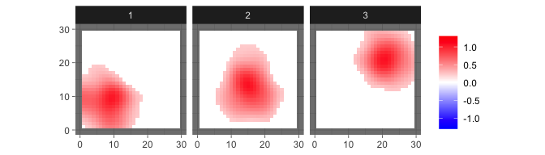
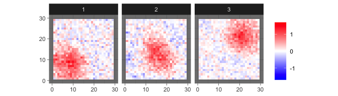
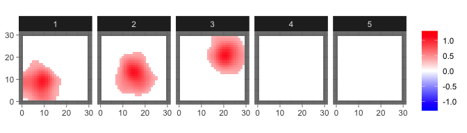

<!-- README.md is generated from README.Rmd. Please edit that file -->

# BSPBSS

<!-- badges: start -->
<!-- badges: end -->

Bayesian Spatial Blind Source Separation via Thresholded Gaussian
Process.

## Installation

Install the released version of nlss from Github with:

``` r
devtools::install_github("benwu233/BSPBSS")
```

## A toy example

This is a basic example which shows you how to solve a common problem:

First we load the package and generate simulated images with a
probabilistic ICA model:

``` r
library(BSPBSS)
set.seed(612)
sim = sim_2Dimage(length = 30, sigma = 5e-4, n = 30, smooth = 0)
```

The true source signals are three 2D geometric patterns

``` r
levelplot2D(sim$S,lim = c(-0.04,0.04), sim$coords)
```


which generate observed images such as

``` r
levelplot2D(sim$X[1:3,], lim = c(-0.12,0.12), sim$coords)
```


Then we generate initial values for mcmc…

``` r
ini = init_bspbss(sim$X, sim$coords, q = 3, ker_par = c(0.1,50), num_eigen = 50)
```

and run!

``` r
MClength = 2000
burn_in = 1000
show_step = 100
res = mcmc_bspbss(ini$X,ini$init,ini$prior,ini$kernel,ep=0.1,lr = 0.01,decay=0.01, subsample_n = 0.5, subsample_p = 0.5,MClength,burn_in,thin=10,show_step)
```

Then the results can be summarized by

``` r
res_sum = sum_mcmc_bspbss(res, ini$X, ini$kernel, start = 101, end = 200, select_p = 0.5)
```

and shown by

``` r
levelplot2D(res_sum$S, lim = c(-1.2,1.2), sim$coords)
```



For comparison, informax ICA provides estimation as

``` r
levelplot2D(ini$init$ICA_S, lim = c(-1.6,1.6), sim$coords)
```



We may overspecify the number of components

``` r
ini = init_bspbss(sim$X, sim$coords, q = 5, ker_par = c(0.1,50), num_eigen = 50)
res = mcmc_bspbss(ini$X,ini$init,ini$prior,ini$kernel,MClength,burn_in,thin=10,show_step)
res_sum = sum_mcmc_bspbss(res, ini$X, ini$kernel, start = 101, end = 200, select_p = 0.5)
levelplot2D(res_sum$S, lim = c(-1.2,1.2), sim$coords)
```


