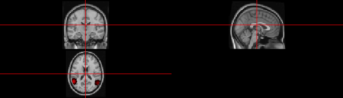
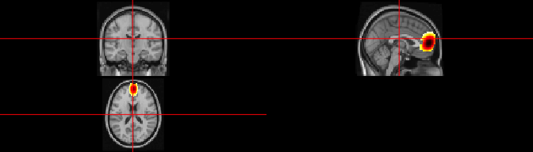

<!-- README.md is generated from README.Rmd. Please edit that file -->

# BSPBSS

<!-- badges: start -->
<!-- badges: end -->

Bayesian Spatial Blind Source Separation via Thresholded Gaussian
Process.

## Installation

Install the released version of BSPBSS from Github with:

``` r
devtools::install_github("benwu233/BSPBSS")
```

## A toy example

This is a basic example which shows you how to solve a common problem.

First we load the package and generate simulated images with a
probabilistic ICA model:

``` r
library(BSPBSS)
set.seed(612)
sim = sim_2Dimage(length = 30, sigma = 5e-4, n = 30, smooth = 6)
```

The true source signals are three 2D geometric patterns (set `smooth=0`
to generate patterns with sharp edges).

``` r
levelplot2D(sim$S,lim = c(-0.04,0.04), sim$coords)
```


which generate observed images such as

``` r
levelplot2D(sim$X[1:3,], lim = c(-0.12,0.12), sim$coords)
```


Then we generate initial values for mcmc,

``` r
ini = init_bspbss(sim$X, sim$coords, q = 3, ker_par = c(0.1,50), num_eigen = 50)
```

and run!

``` r
res = mcmc_bspbss(ini$X,ini$init,ini$prior,ini$kernel,n.iter=2000,n.burn_in=1000,thin=10,show_step=100)
```

Then the results can be summarized by

``` r
res_sum = sum_mcmc_bspbss(res, ini$X, ini$kernel, start = 101, end = 200, select_p = 0.5)
```

and shown by

``` r
levelplot2D(res_sum$S, lim = c(-1.3,1.3), sim$coords)
```


For comparison, we show the estimated sources provided by informax ICA
here.

``` r
levelplot2D(ini$init$ICA_S, lim = c(-1.7,1.7), sim$coords)
```


We may overspecify the number of components and still obtain reasonable
results.

``` r
ini = init_bspbss(sim$X, sim$coords, q = 5, ker_par = c(0.1,50), num_eigen = 50)
res = mcmc_bspbss(ini$X,ini$init,ini$prior,ini$kernel,n.iter=2000,n.burn_in=1000,thin=10,show_step=100)
res_sum = sum_mcmc_bspbss(res, ini$X, ini$kernel, start = 101, end = 200, select_p = 0.5)
levelplot2D(res_sum$S, lim = c(-1.3,1.3), sim$coords)
```


## NIfTI data

Install a small pack contains simulated NIfTI images and MNI152
template.

``` r
devtools::install_github("benwu233/SIMDATA")
```

Load and take a glance at the data.

``` r
data_path = system.file("extdata",package="SIMDATA") 
t1_3mm = neurobase::readNIfTI2(paste0(data_path,"/template/MNI152_T1_3mm.nii.gz"))
sim_4d = neurobase::readNIfTI2(paste0(data_path,"/sim_4d/sim_4d.nii.gz"))
mask = neurobase::readNIfTI2(paste0(data_path,"/sim_4d/mask.nii.gz"))
neurobase::ortho2(t1_3mm, y=sim_4d[,,,1])
```


Conduct BSPBSS.

``` r
X = pre_nii(sim_4d,mask)
ini = init_bspbss(X$data, X$coords, dens = 0.5, q = 3, ker_par = c(0.01, 120), num_eigen = 200)
res = mcmc_bspbss(ini$X,ini$init,ini$prior,ini$kernel,n.iter=4000,n.burn_in=2000,thin=10,show_step=100,subsample_p=0.005)
res_sum = sum_mcmc_bspbss(res, ini$X, ini$kernel, start = 201, end = 400, select_p = 0.5)
```

Output:

``` r
ICs = output_nii(res_sum$S,sim_4d,X$coords,file=NULL,std=TRUE)
```

Component 1:

``` r
neurobase::ortho2(t1_3mm,y=ICs[,,,1])
```


Component 2:

``` r
neurobase::ortho2(t1_3mm,y=ICs[,,,2])
```


Component 3:

``` r
neurobase::ortho2(t1_3mm,y=ICs[,,,3])
```


